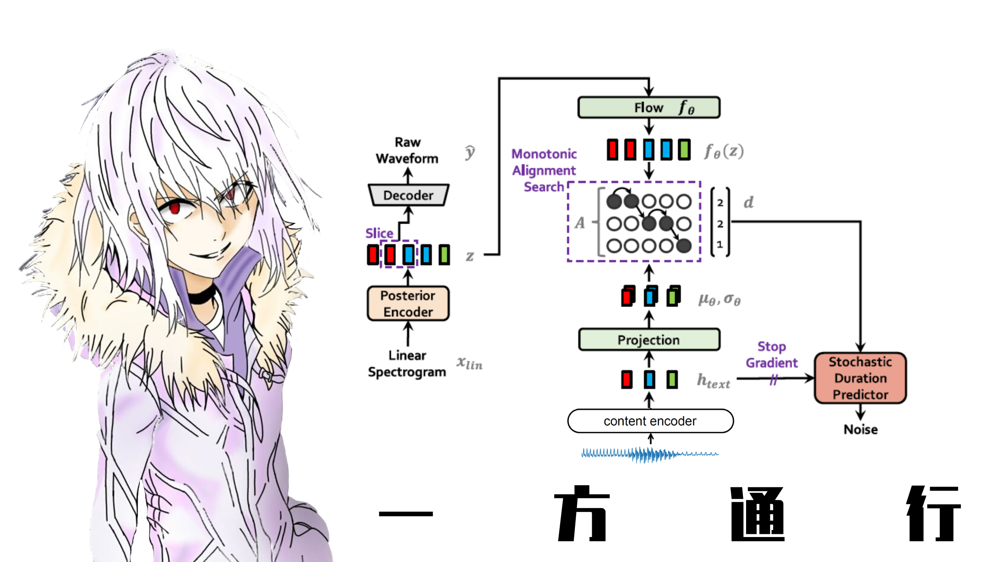

<h1>Stella VC Based on Soft-VC and VITS</h1>

<h2>Contents</h2>

- [Update](#Update)
- [Introduction](#Introduction)
- [Models](#Models)
  - [A Certain Scientific Accelerator](#Accelerator)
  - [A Certain Magical Index](#Index)
  - [Shiki Natsume](#Natsume)
- [How to use](#Usage)
- [Contact](#Contact)
- [Acknowledgement](#Ack)
- [References](#References)

<h2 id="Update">Update</h2>

- 30/8 Start training model of *A Certain Magical Index*!

- 30/8 Multi-speaker training is available!

- 30/8 Start training model of *Shiki Natsume*!

- 29/8 Start training model of *Accelerator*!

<h2 id="Introduction">Introduction</h2>

Inspired by [Rcell](https://space.bilibili.com/343303724/?spm_id_from=333.999.0.0), I replaced the word embedding of `TextEncoder` in VITS with the output of the `ContentEncoder` used in [Soft-VC](https://github.com/bshall/soft-vc) to achieve any-to-one voice conversion with non-parallel data. Of course, any-to-many voice converison is also doable!

If you are interested in the performance of Soft-VC, you may refer to [this demo](https://colab.research.google.com/drive/11L10uz2VsF3_YCanXKYiA3mo9eMW4ueL?usp=sharing). I've trained a aoustic model for
3 days with about 2000 audio clips. 

<h2 id="Models">Models</h2>

<h3 id="Accelerator">A Certain Scientific Accelerator</h3>



- Description

- Demo

<h3 id="Index">A Certain Magical Index</h3>


- Description

- Demo

<h3 id="Natsume">Shiki Natsume</h3>


- Description

- Demo

<h2 id="Usage">How to use</h2>

### Train

#### Prepare dataset

Audio should be `wav` file, with mono channel and a sampling rate of 22050 Hz. 

Your dataset should be like:

```
└───wavs
    ├───dev
    │   ├───LJ001-0001.wav
    │   ├───...
    │   └───LJ050-0278.wav
    └───train
        ├───LJ002-0332.wav
        ├───...
        └───LJ047-0007.wav
```

#### Extract speech units

Utilize the content encoder to extract speech units in the audio.

For more information, refer to [this repo](https://github.com/bshall/acoustic-model).

```python
cd hubert
python3 encode.py soft path/to/wavs/directory path/to/soft/directory --extension .wav
```
Then you need to generate filelists for both your training and validation files. It's recommended that you prepare your filelists beforehand!

Your filelists should look like:

Single speaker:

```
path/to/wav|path/to/unit
...
```

Multi-speaker:

```
path/to/wav|id|path/to/unit
...
```

#### Train Sovits

Single speaker:

```
python train.py -c configs/config.json -m model_name
```

Multi-speaker:

```
python train_ms.py -c configs/config.json -m model_name
```

You may also refer to [train.ipynb](train.ipynb)

### Inference

Please refer to [inference.ipynb](inference.ipynb)

<h2 id="Contact">Contact</h2>

QQ: 2235306122

BILIBILI: [Francis-Komizu](https://space.bilibili.com/636704927)

<h2 id="Ack">Ackowledgement</h2>

Special thanks to [Rcell](https://space.bilibili.com/343303724/?spm_id_from=333.999.0.0) for giving me both inspiration and advice!

<h2 id="References">References</h2>

[基于VITS和SoftVC实现任意对一VoiceConversion](https://www.bilibili.com/video/BV1S14y1x78X?share_source=copy_web&vd_source=630b87174c967a898cae3765fba3bfa8)

[Soft-VC](https://github.com/bshall/soft-vc)

[vits](https://github.com/jaywalnut310/vits)
