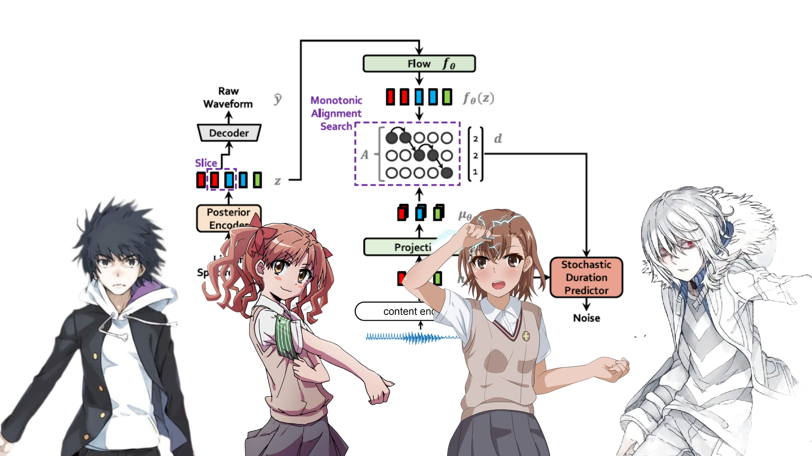
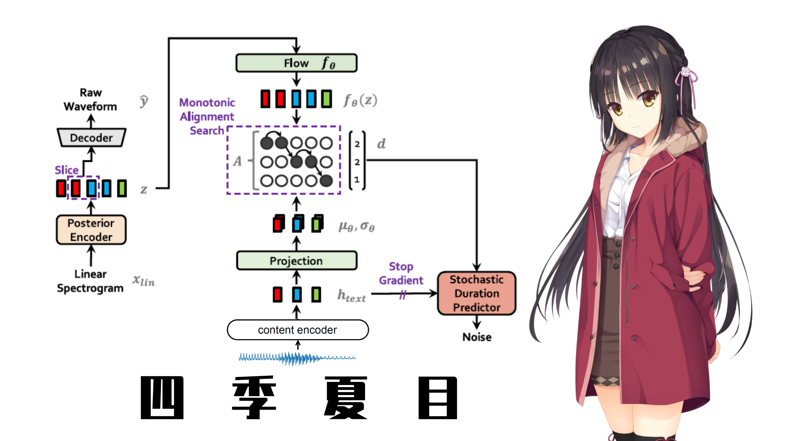
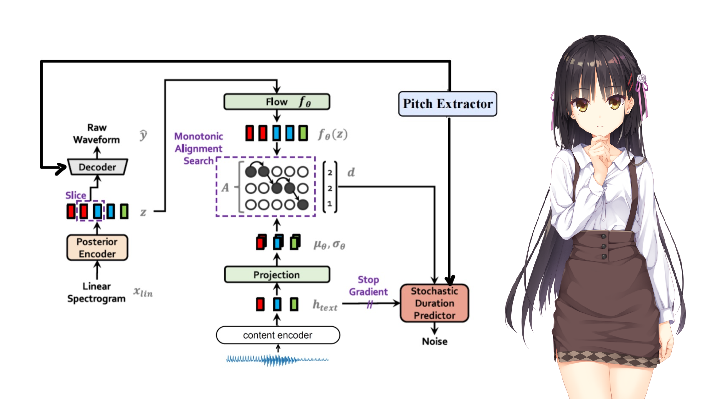

<h1>Stella VC Based on Soft-VC and VITS</h1>

## **This project is closed...**

<h2>Contents</h2>

- [Update](#Update)
- [Introduction](#Introduction)
- [Models](#Models)
  - [A Certain Magical Index](#Index)
  - [Shiki Natsume](#Natsume)
  - [Shiki Natsume 2.0](#Natsume2)
- [How to use](#Usage)
- [TODO](#TODO)
- [Contact](#Contact)
- [Acknowledgement](#Ack)
- [References](#References)

<h2 id="Update">Update</h2>

- Sovits 2.0 inference demo is available!

<h2 id="Introduction">Introduction</h2>

Inspired by [Rcell](https://space.bilibili.com/343303724/?spm_id_from=333.999.0.0), I replaced the word embedding of `TextEncoder` in VITS with the output of the `ContentEncoder` used in [Soft-VC](https://github.com/bshall/soft-vc) to achieve any-to-one voice conversion with non-parallel data. Of course, any-to-many voice converison is also doable!

For better voice quality, in Sovits2, I utilize the f0 model used in [StarGANv2-VC](https://github.com/yl4579/StarGANv2-VC) to get fundamental frequency feature of an input audio and feed it to the vocoder of VITS.

<h2 id="Models">Models</h2>

<h3 id="Index">A Certain Magical Index</h3>



- Description

|Speaker|ID|
|-|-|
|一方通行|0|
|上条当麻|1|
|御坂美琴|2|
|白井黑子|3|

- Model: [Google drive](https://drive.google.com/file/d/1QfLYyqCEKlqC6fLYccISoIRxeqKEUtLs/view?usp=sharing)

- Config: in this repository

- Demo
  - Colab: [Sovits (魔法禁书目录)](https://colab.research.google.com/drive/1OjfH2zpRkLFRp92aU6jAGhqZNopfZMjC?usp=sharing)
  - BILIBILI: [基于Sovits的4人声音转换模型](https://www.bilibili.com/video/BV1zY4y1T71W?share_source=copy_web&vd_source=630b87174c967a898cae3765fba3bfa8)

<h3 id="Natsume">Shiki Natsume</h3>



- Description

Single speaker model of Shiki Natsume.

- Model: [Google drive](https://drive.google.com/file/d/1eco4a1KTQt6YHv6Nza9XesF3Ao6JktBL/view?usp=sharing)

- Config: in this repository

- Demo
  - Colab: [Sovits (四季夏目)](https://colab.research.google.com/drive/190IbYEorG1wnw-QbUPH9SD6JytLF0KRv?usp=sharing)
  - BILIBILI: [枣子姐变声器](https://www.bilibili.com/video/BV13e411u7f1?share_source=copy_web&vd_source=630b87174c967a898cae3765fba3bfa8)
  
<h3 id="Natsume2">Shiki Natsume 2.0</h3>



- Description

Single speaker model of Shiki Natsume, trained with F0 feature.

- Model: [Google drive](https://drive.google.com/file/d/1-0s7NBk49MMJzF-aBaqfuclVgF4yJzXa/view?usp=sharing)

- Config: in this repository

- Demo
  - Colab: [Sovits2 (四季夏目)](https://colab.research.google.com/drive/11GC7uAgPya2UIb5jfIuwnIqUN2qPF37w?usp=sharing)

<h2 id="Usage">How to use</h2>

### Train

#### Prepare dataset

Audio should be `wav` file, with mono channel and a sampling rate of 22050 Hz. 

Your dataset should be like:

```
└───wavs
    ├───dev
    │   ├───LJ001-0001.wav
    │   ├───...
    │   └───LJ050-0278.wav
    └───train
        ├───LJ002-0332.wav
        ├───...
        └───LJ047-0007.wav
```

#### Extract speech units

Utilize the content encoder to extract speech units in the audio.

For more information, refer to [this repo](https://github.com/bshall/acoustic-model).

```python
cd hubert
python3 encode.py soft path/to/wavs/directory path/to/soft/directory --extension .wav
```
Then you need to generate filelists for both your training and validation files. It's recommended that you prepare your filelists beforehand!

Your filelists should look like:

Single speaker:

```
path/to/wav|path/to/unit
...
```

Multi-speaker:

```
path/to/wav|id|path/to/unit
...
```

#### Train Sovits

Single speaker:

```
python train.py -c configs/config.json -m model_name
```

Multi-speaker:

```
python train_ms.py -c configs/config.json -m model_name
```

You may also refer to [train.ipynb](train.ipynb)

### Inference

Please refer to [inference.ipynb](inference.ipynb)

<h2 id="TODO">TOD0</h2>

- [x] Add F0 model
- [ ] Add F0 loss

<h2 id="Contact">Contact</h2>

QQ: 2235306122

BILIBILI: [Francis-Komizu](https://space.bilibili.com/636704927)

<h2 id="Ack">Ackowledgement</h2>

Special thanks to [Rcell](https://space.bilibili.com/343303724/?spm_id_from=333.999.0.0) for giving me both inspiration and advice!

<h2 id="References">References</h2>

[基于VITS和SoftVC实现任意对一VoiceConversion](https://www.bilibili.com/video/BV1S14y1x78X?share_source=copy_web&vd_source=630b87174c967a898cae3765fba3bfa8)

[Soft-VC](https://github.com/bshall/soft-vc)

[vits](https://github.com/jaywalnut310/vits)

[StarGANv2-VC](https://github.com/yl4579/StarGANv2-VC)
